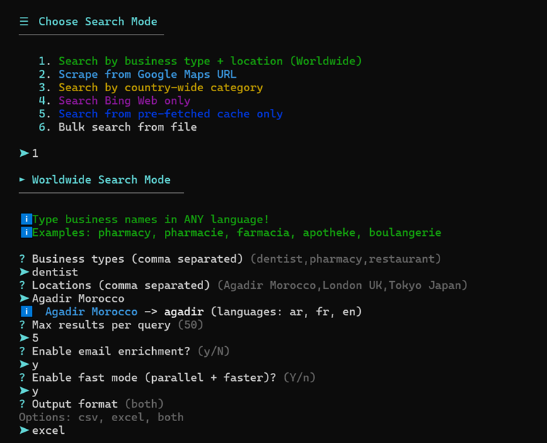
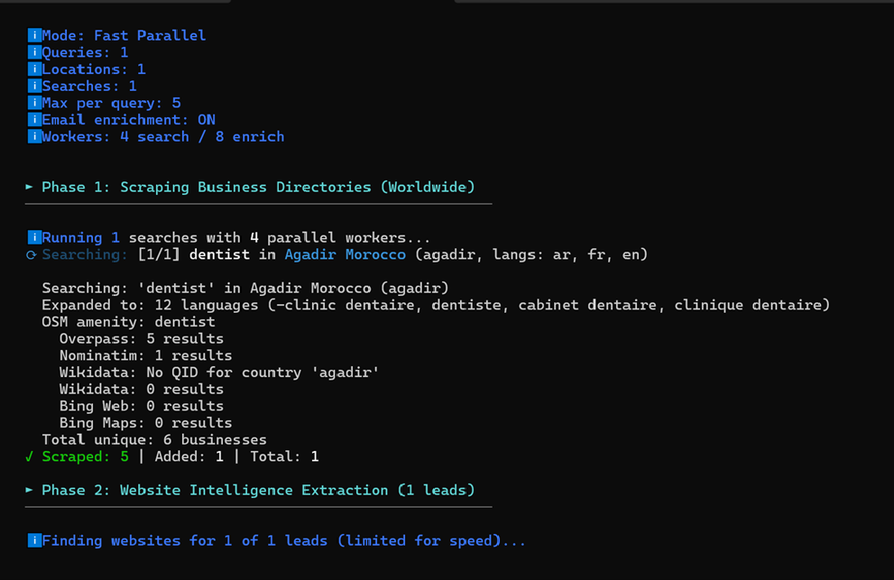
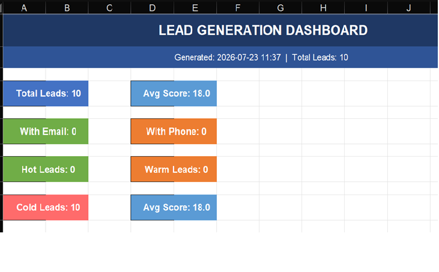
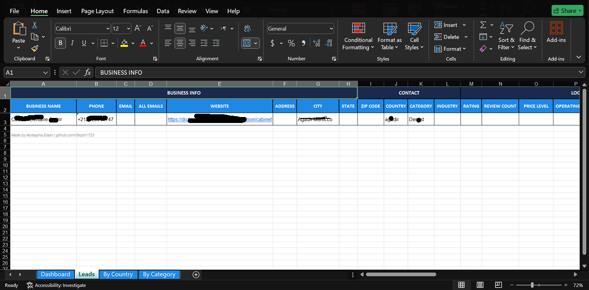

<div align="center">

# Lead Generator Pro

**Free, open-source business lead scraper with email extraction, proxy rotation, and anti-detection.**

**No API keys. No limits. No paywalls.**


</div>

---

## Screenshots

<!-- Add your screenshots to the screenshots/ folder and uncomment below -->

<!--  -->
<!--  -->
<!--  -->
<!--  -->

---

## What Is This?

Lead Generator Pro is a **Python-based lead generation tool** that scrapes business data from multiple sources, enriches it with emails and social profiles, and exports everything to professional Excel reports with charts and dashboards.

It's built for **small businesses, freelancers, marketers, and anyone** who needs leads without paying for expensive SaaS tools like Apollo, Hunter, or ZoomInfo.

### Key Numbers

| Metric | Value |
|--------|-------|
| Data Sources | 8 active sources |
| Email Fallbacks | 6 extraction methods |
| Business Types | 61 categories |
| Countries | 150+ supported |
| Free Proxies | 200+ auto-fetched |
| Browser Fingerprints | 16 rotating |
| Excel Sheets | 4 (Dashboard, Leads, By Country, By Category) |

---

## Features

| Feature | Description |
|---------|-------------|
| **Multi-Source Scraping** | Overpass API, Nominatim, Wikidata SPARQL, Bing Web, Bing Maps, SearXNG, Mojeek |
| **6 Email Fallbacks** | MX records, Wayback Machine, SMTP verification, Bing site: search, Google cache, Social media bios |
| **Auto Proxy Rotation** | Fetches 200+ free proxies, rotates per request, auto-removes dead proxies |
| **Agent Rotation** | 16 browser fingerprints (Chrome, Firefox, Safari, Edge, mobile + desktop) |
| **6 Search Modes** | Business+Location, Maps URL, Country-wide, Bing Web, Cache, Bulk file |
| **Anti-Detection** | Rate limiting, referrer rotation, country-based Accept-Language, Cloudflare handling |
| **Professional Excel** | 4-sheet export with pie/bar charts, Material Design colors, column groups, alternating rows |
| **Lead Scoring** | 0-100 score based on email, phone, social profiles, website, TripAdvisor |
| **Thread-Safe Parallel** | Configurable workers (4 search + 8 enrichment) with ThreadPoolExecutor |
| **Deduplication** | Keeps best-scored lead per business, prevents duplicates |
| **Data Cleaning** | Validates emails, normalizes phones, strips UTM params, removes generic names |
| **61 Business Types** | Dentists, restaurants, pharmacies, lawyers, and 57 more — with multilingual search |

---

## Quick Start

### Installation

```bash
git clone https://github.com/Stoph1723/lead-generator-pro.git
cd lead-generator-pro
pip install -r requirements.txt
```

### Run

```bash
# Interactive mode (recommended for first use)
python main.py

# CLI mode
python main.py --query "dentist,pharmacy" --location "London UK,Paris FR"

# Fast mode with free proxies
python main.py --query "restaurant" --location "Tokyo Japan" --fast --free-proxies

# Scrape from Google Maps URL
python main.py --url "https://www.google.com/maps/search/dentist+agadir"

# Bulk file mode (queries from file)
python main.py
# Then select Mode 6 from the menu
```

---

## CLI Arguments

| Argument | Default | Description |
|----------|---------|-------------|
| `--url` | — | Google Maps URL to scrape |
| `--query` | — | Business types (comma separated) |
| `--location` | — | Locations (comma separated) |
| `--max` | `50` | Max results per query |
| `--fast` | `false` | Fast mode: parallel workers + reduced delays |
| `--no-email` | `false` | Skip email enrichment (faster) |
| `--search-workers` | `4` | Parallel search threads |
| `--enrich-workers` | `8` | Parallel enrichment threads |
| `--output` | `both` | Output format: `csv`, `excel`, or `both` |
| `--proxy` | — | Single proxy: `http://host:port` |
| `--proxy-file` | — | File with proxies (one per line) |
| `--free-proxies` | `false` | Auto-fetch and rotate free proxies |

---

## Search Sources

| Source | Type | Notes |
|--------|------|-------|
| **Overpass API** | Structured | OpenStreetMap — businesses with phone/email/website |
| **Nominatim** | Structured | OpenStreetMap geocoding |
| **Wikidata SPARQL** | Structured | Wikipedia/Wikidata structured business data |
| **Bing Web** | Web search | Location-aware queries with retry logic |
| **Bing Maps** | Web search | JSON-LD structured data extraction |
| **SearXNG** | Meta-search | Aggregates Google, Bing, DuckDuckGo |
| **Mojeek** | Web search | Independent, no tracking/blocking |
| **Overpass Expanded** | Structured | Multilingual Overpass queries for better coverage |

---

## Email Extraction Pipeline

```
Website Found
    ├── MX Record Check (DNS)
    ├── Wayback Machine (historical pages)
    ├── Contact Page Crawl (/contact, /about, /team)
    ├── Pattern Guessing + SMTP Verification (info@, contact@, hello@...)
    ├── Bing site:domain Search
    ├── Google Cache Search
    └── Social Media Bios (Facebook, LinkedIn, Instagram)
```

---

## Architecture

```
lead_generator/
├── main.py              # Main orchestrator + CLI
├── config.py            # Configuration (workers, delays, proxies)
├── scrapers/
│   ├── crawler.py       # Anti-bypass HTTP client with proxy rotation
│   ├── google_maps.py   # 8-source search pipeline
│   ├── email_finder.py  # Website intelligence + 6 email fallbacks
│   └── wikidata.py      # Wikidata SPARQL scraper
├── models/
│   └── lead.py          # Lead data model + LeadCollection
├── utils/
│   ├── cleaner.py       # Data validation & cleaning
│   ├── exporter.py      # CSV + Excel export (4 sheets, charts)
│   ├── keywords.py      # 61 business types, 590 country mappings
│   ├── ui.py            # Terminal UI (ANSI colors, no dependencies)
│   └── web_cache.py     # Cache layer
└── output/              # Generated files
```

---

## Output Example

Results are saved to `output/` with timestamps:

- **CSV** — Clean, CRM-importable format
- **Excel** — 4 professional sheets:
  - **Dashboard** — Stats, pie charts, bar charts, score distribution
  - **Leads** — All data with column groups and alternating colors
  - **By Country** — Breakdown by country
  - **By Category** — Breakdown by business type

---

## Requirements

- Python 3.10+
- No Playwright/Selenium needed (pure HTTP requests)
- No API keys required
- Works on Windows, macOS, Linux

```
beautifulsoup4>=4.12.0
lxml>=5.0.0
requests>=2.32.0
openpyxl>=3.1.0
urllib3>=2.0.0
```

---

## Disclaimer

This tool is provided for **educational and legitimate business purposes only**. Users are responsible for complying with the terms of service of any website they scrape. The author is not responsible for any misuse of this software.

---

## License

This project is licensed under the **Creative Commons Attribution-NonCommercial 4.0 International License (CC BY-NC 4.0)**.

You are free to:
- **Share** — copy and redistribute the material in any medium or format
- **Adapt** — remix, transform, and build upon the material

Under the following terms:
- **Attribution** — You must give appropriate credit to **Mustapha Elasri**, provide a link to the license, and indicate if changes were made
- **NonCommercial** — You may not use the material for commercial purposes (selling the tool or derivative works)

Full license: [LICENSE](LICENSE)

---

## Credits

**Created by [Mustapha Elasri](https://github.com/Stoph1723)**

If you use this project, please give credit by mentioning:
> Lead Generator Pro by Mustapha Elasri — https://github.com/Stoph1723/lead-generator-pro

---

## Contributing

Contributions are welcome! See [CONTRIBUTING.md](CONTRIBUTING.md) for guidelines.

---

## Support

If this tool helped you, consider:
- Starring the repo
- Sharing it with others
- Contributing improvements
